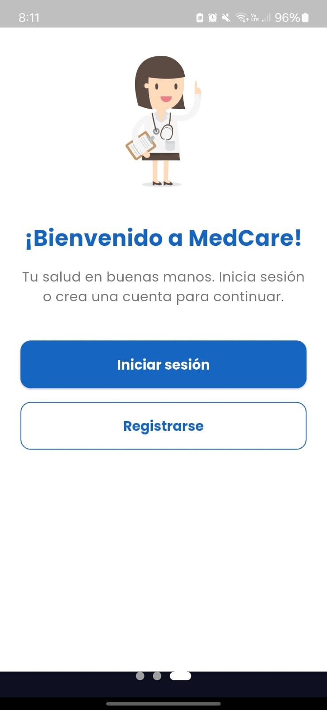
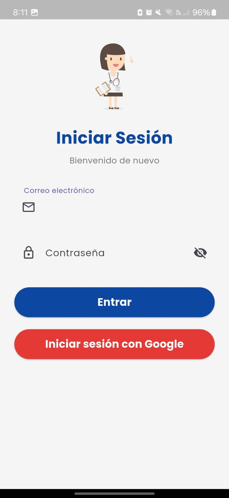
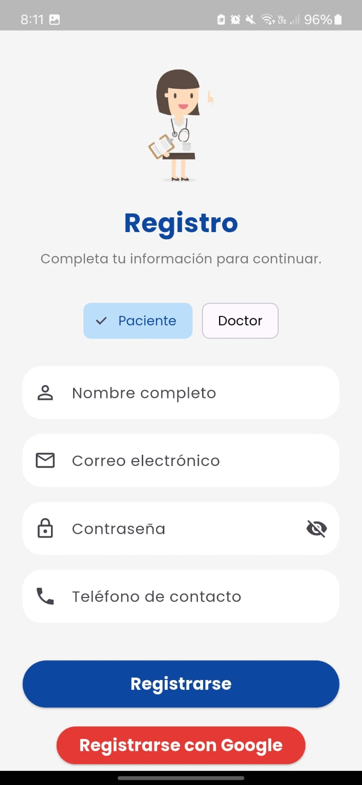
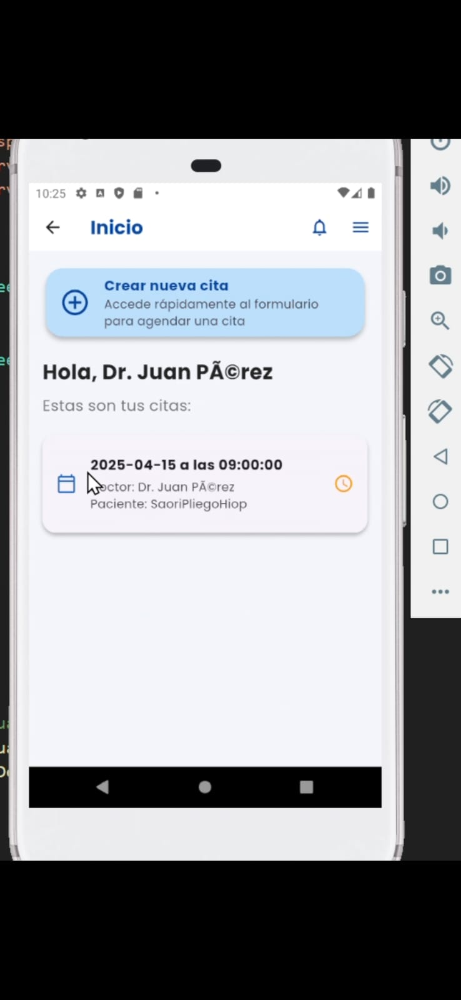
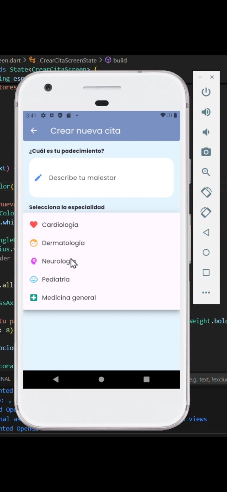

# 🩺 FlutterCitasMedicasDEMO

Una app demo desarrollada con **Flutter** para la gestión de citas médicas, enfocada en una arquitectura modular, buenas prácticas y experiencia de usuario intuitiva.

Este proyecto simula un sistema real de **registro, inicio de sesión, reserva de citas, y manejo de usuarios médicos o pacientes**, todo desde una estructura limpia y escalable.

---

## 🌟 Características principales

- 👤 **Registro e inicio de sesión** tradicional o con Google.
- 📲 **Onboarding amigable** para primeros usuarios.
- 📅 **Reserva de citas médicas** con formulario dinámico.
- 🩻 **Visualización de citas** según el rol (paciente/doctor).
- 🔄 **Cambio de estado de cita** para doctores.
- 🎯 **Filtros por especialidad** para seleccionar al médico ideal.
- 🧱 Arquitectura limpia: `HttpClient`, `Repository`, `Service`, `DTOs`.

---

## 📲 Flujo visual de la app

### 🟦 Onboarding
> Introduce la app con un diseño limpio y profesional.

### 🔐 Login y Registro
> Autenticación por correo o Google Sign-In.

| Login | Registro |
|-------|----------|
|  |  |

### 🏠 Pantalla principal
> Acceso a funciones clave y navegación.

### 📝 Reservar una cita
> Formulario dinámico según el rol del usuario.

| Formulario | Confirmación |
|------------|--------------|
|  |  |

---

## 🧱 Estructura del proyecto

<pre> <code> lib/ ├── data/ │ ├── http/ # Cliente HTTP y repositorios (Auth, Citas, etc.) │ ├── models/ # Clases DTO: request y response │ └── services/ # Lógica de negocio (AuthService, CitaService) ├── presentation/ │ ├── pages/ # Pantallas principales │ └── widgets/ # Componentes reutilizables └── main.dart # Punto de entrada de la aplicación </code> </pre>

---

## ⚙️ Tecnologías usadas

- **Flutter** 3.x
- `http` – para comunicación con API REST
- `google_sign_in` – para autenticación social
- `shared_preferences` – para almacenar token localmente
- `Material Design` – diseño de UI nativo

